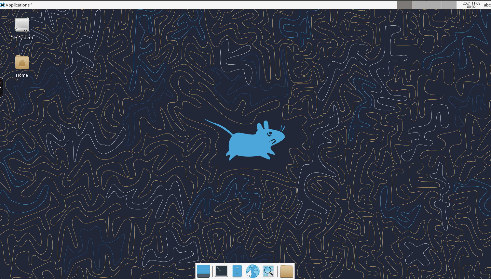

# Project README

## Description

This project uses Docker and Docker Compose to manage and run Jason in a containerized environment.

## Prerequisites

- Docker
- Docker Compose

## Running the Application

To run the application, ensure you are in the project root directory and execute the following command:

```sh
docker-compose up
```

This command will download jason, gradle, configure then and build and start the application.

The application will spin up a linux container that will be available at: http://localhost:3000/



## How to run the projects?

Go to the folder "projects" and create the projects in there. For example:
    
```sh
jason app create app1
```

You need to get into the project folder and run the following command:

```sh
gradle run
```


## Additional Information

For more information on Docker and Docker Compose, refer to the official documentation:

- [Docker Documentation](https://docs.docker.com/)
- [Docker Compose Documentation](https://docs.docker.com/compose/)